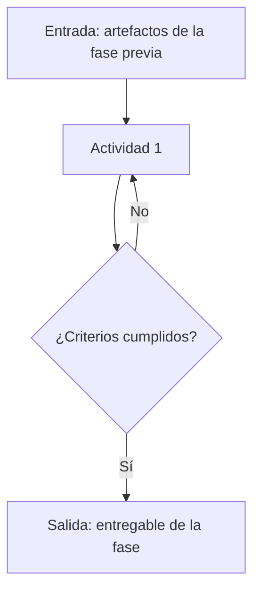
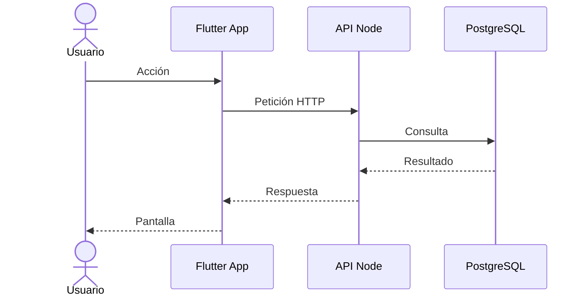

# Flujo — Fase <N>: <Nombre>

## Flujo de la fase (proceso)

```mermaid
flowchart TD
    A[Entrada: artefactos de la fase previa] --> B[Actividad 1]
    B --> C{¿Criterios cumplidos?}
    C -- Sí --> D[Salida: entregable de la fase]
    C -- No --> B
```

## Flujo funcional del sistema (el que corresponde a esta fase)

```mermaid
sequenceDiagram
    actor U as Usuario
    participant F as Flutter App
    participant A as API Node
    participant D as PostgreSQL
    U->>F: Acción
    F->>A: Petición HTTP
    A->>D: Consulta
    D-->>A: Resultado
    A-->>F: Respuesta
    F-->>U: Pantalla
```

## Descripción paso a paso
1. …
